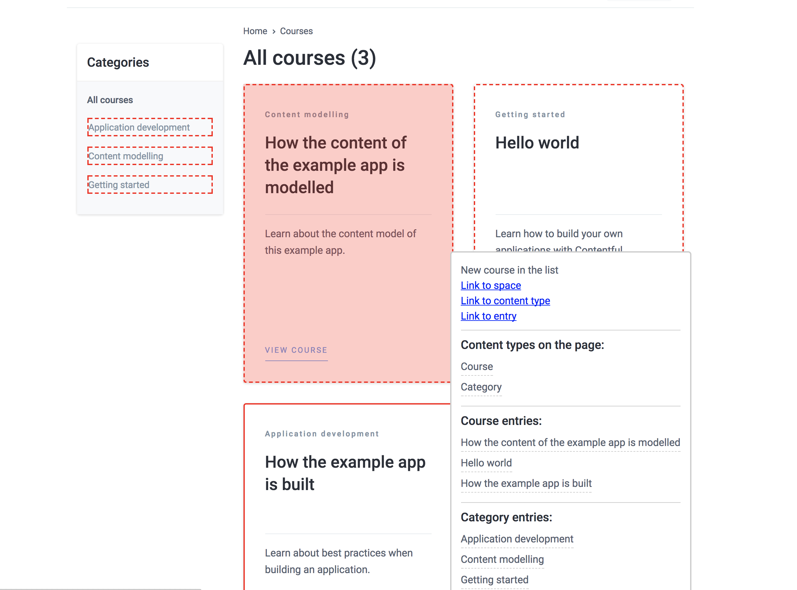

# Contentful-wizard

[](https://badge.fury.io/js/contentful-wizard)
[](https://github.com/prettier/prettier)

This is a library to add an interactive content explorer to your [contentful-powered project](https://www.contentful.com/) – it allows you to mark parts of your application, and this library will highlight marked block, add automatic tooltips on hover with links to contentful application.

It allows your editors quickly understand which element on the page is responsible for specific entry and content type (or an asset, if you want to mark it to this details).

> Blog example: [live demo](https://dist-dohdcjzdoz.now.sh/) | [integration commit](https://github.com/Bloomca/blog-in-5-minutes/commit/2419bcf23e54e59ec130728432b986078bc11b88)




This is only client-side library, it assumes DOM is available.
Right now it is in pre-alpha stage, but you can take a look [at the roadmap](./Roadmap.md) to get a feeling what is going to be implemented.

> This library is in alpha stage – it is a proof of concept with (likely) a lot of bugs. Feedback is welcome!

## Getting started

First, you need to include this library into your application – you can just include [umd build](https://unpkg.com/contentful-wizard@0.0.1-alpha-6/dist/contentful-wizard.min.js). It will add a global object, which you can call to instantiate a wizard – this will iterate over all DOM elements, picking those with `data-ctfl-entry` and `data-ctfl-asset` data attributes, highlight borders of these elements and add tooltips on hover with all links and info about other elements on the page.

> You can customize a lot of things, but this is the bare minimum, which might be enough

```html
<script src="https://unpkg.com/contentful-wizard@0.0.1-alpha-6/dist/contentful-wizard.min.js"></script>

<div data-ctf-content-type="17WjnjeALEOeSyuiMI4QOx" data-ctfl-entry="VQGkwljpe0AmqOmOuW8i9">
  <!-- your entry content -->
</div>

<div data-ctfl-asset="6nvWJT1AkM64so8Auue4Qx">
  <!-- your asset content -->
</div>

<script>
CTFLWizard.init({
  spaceId: 's25qxvg',
  key: 'f78aw812mlswwasw' // your API key
});
</script>
```

## Entry titles

In the tooltip's content we show:
- content types on the page
- entries on the page
- assets on the page

Content types and assets have special properties (`name` for content types and `fields.title` for assets), but entries have only specified fields, so there is no way to generalize it. In order to address it, and to list entries in human-readable form, you can pass an `entryTitle` property into `CTFLWizard.init` method configuration object. There are several strategies supported:

```js
CTFLWizard.init({
  spaceId: 's25qxvg',
  key: 'f78aw812mlswwasw', // your API key
  // if all your entries should show this field's value
  entryTitle: 'myTitle',

  // or, if you need to display different fields
  // for different content types
  entryTitle: {
    [contenTypeId]: 'mySpecialTitle'
  }
});
```

If you don't provide any (or fields by your strategy don't exist or don't have a value), the library will try to get `title` field first, and then `name`. However, it is still pretty magical, so it is better to provide your own field names.

> There is no "smart" guessing strategy (like trying to list all fields with string value and get one with a short enough value), since it can easily introduce incosistency, and it will become confusing.

## Styling

Your use-case might be different – for example, you need wide tooltips, or default colours don't match your schema; you can customize all default styles, except positioning (`top`, `left`, `right`, `bottom`), it is calculated automatically and adjusted to the content. You provide your own styling during calling `CTFLWizard.init`, and you can omit any of these properties, and the whole property is optional – below you can find a commented breakdown on all style options:

> Since it is in pre-alpha (read: super-early) and styles are subject to change, I don't want to share styles to avoid frequent updates. Once it stabilizies, all default styles will be shown in this snippet

```js
CTFLWizard.init({
  spaceId: 's25qxvg',
  key: 'f78aw812mlswwasw', // your API key
  
  // the whole property is optional
  style: {
    // style of the container to indicate
    // that it has hover capabilities
    highlight: {
      border: '2px dashed #ccc'
    },
    // style during the hover
    highlightHover: {
      border: '2px solid #ccc'
    },
    // styles of the tooltip itself
    tooltip: {
      background: '#ccc'
    },
    // overlay – when we hover types in the tooltip
    // we add overlay to corresponding elements
    overlay: {
      background: 'green'
    }
  }
});
```

## Update Tooltips

Create wizard instance initializes the library, attaching listeners to all elements with corresponding data-attributes to show tooltip on hovering. However, sometimes you change content on your page, and you would like to add tooltips for new content. In order to do that, you can invoke `.update` method on returned instance:

> You can provide an arg for `update` method – it is an object with the same parameters as for `init`, so you can override any parameters you had set up before

```js
const wizard = CTFLWizard.init({
  spaceId: 's25qxvg',
  key: 'f78aw812mlswwasw'
});

// after some changes
wizard.update({
  // new entry title field resolution
  entryTitle: 'newTitle'
});
```

Another use case is to remove all listeners completely – for example, you re-rendered everything, or contentful content became irrelevant. In order to do that, you can call `.destroy` method:

```js
const wizard = CTFLWizard.init({
  spaceId: 's25qxvg',
  key: 'f78aw812mlswwasw'
});

// if you want to remove all contentful-wizard functionality
wizard.destroy();
```

## Single Page Applications

In case you have rich web application, where content can change very often, and the whole page updates don't make a lot of sense, since they happen too often, there is a way to attach/deattach them manually – for example, it makes sense to add them in lifecycle hooks. I'll show it using [react lifecycle hooks](https://reactjs.org/docs/state-and-lifecycle.html#adding-lifecycle-methods-to-a-class) as an example, but it works similarly across all popular frameworks.

```js
// init during the bootstrap of your application
import { init } from 'contentful-wizard';

// this is needed to save your key
init({
  spaceId: 'your_space',
  key: 'CDA_key'
});

// wizard component to wrap contentful blocks
import React, { Component } from 'react';
import RPT from 'prop-types';
import { attach } from 'contentful-wizard';

export default class CTFLWizard extends Component {
  static propTypes = {
    children: RPT.node,
    entity: RPT.object,
    description: RPT.string
  }

  componentDidMount() {
    const { entity, description } = this.props;
    const isEntry = entity.sys.type === 'Entry';

    // mount tooltip on our container
    this.cleanup = attach({
      node: this.node,
      // decide which type of contentful entity we have
      entry: isEntry ? entity.sys.id : undefined,
      contentType: isEntry ? entity.sys.contentType.sys.id : undefined,
      asset: isEntry ? undefined : entity.sys.id,
      spaceId: entity.sys.space.sys.id,
      // description for the tooltip
      description
    });
  }

  componentWillMount() {
    this.cleanup && this.cleanup();
  }

  render() {
    const { children } = this.props;

    return (
      <div ref={node => this.node => node}>
        {children}
      </div>
    );
  }
}

// later, in another component:
import Wizard from '../components/wizard';

// ...
const markup = (
  <Wizard entity={course}>
    {course.fields.description}
  </Wizard>
);
```

As you can see, you just have to initialize to save CDA key, and then write one component, which will attach and cleanup tooltips based on the lifecycle hooks.

## Roles and Permissions

Contentful can have pretty intrinsic set of rules and permissions, and it is possible that all presented options can be confusing, since some roles don't have access to some parts of the application (for example, to content types). Unfortunately, right now there is no way to differentiate between roles – we are using CDA (or CPA) key, which is valid to get content of the whole space.

However, there are couple of things in the roadmap:
- configuration of the tooltip (so you can configure it to omit some parts of the tooltip)
- control panel to show only some parts

Please, create an issue in case you feel this is important (and if you have another idea, you are welcome to share it!).

## Usage

This is not ready for usage yet, so it is not distributed yet in any package managers or CDNs. You can build it by yourself, if you really want to:

```sh
npm run build
```

It will build two folders – `lib` and `dist`, where the first one contains ES modules code, and the latter one has [UMD builds](https://github.com/umdjs/umd) to use in the browser directly – you can copy this file to your application and serve by yourself.

## License

MIT